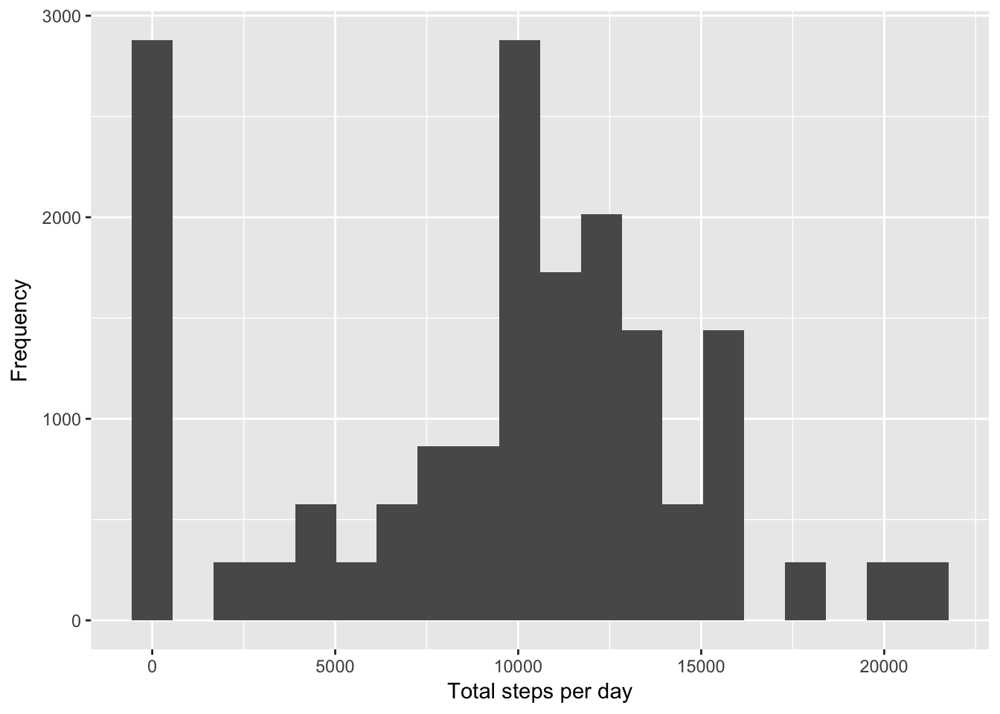
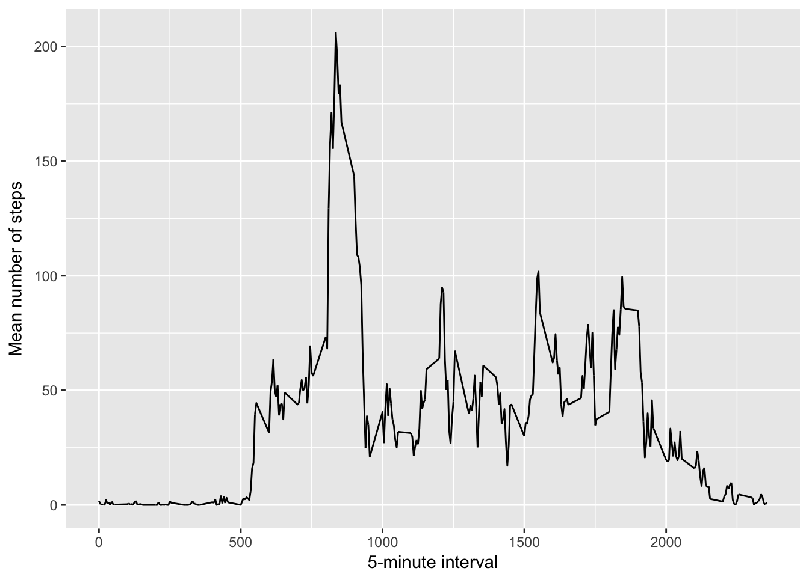
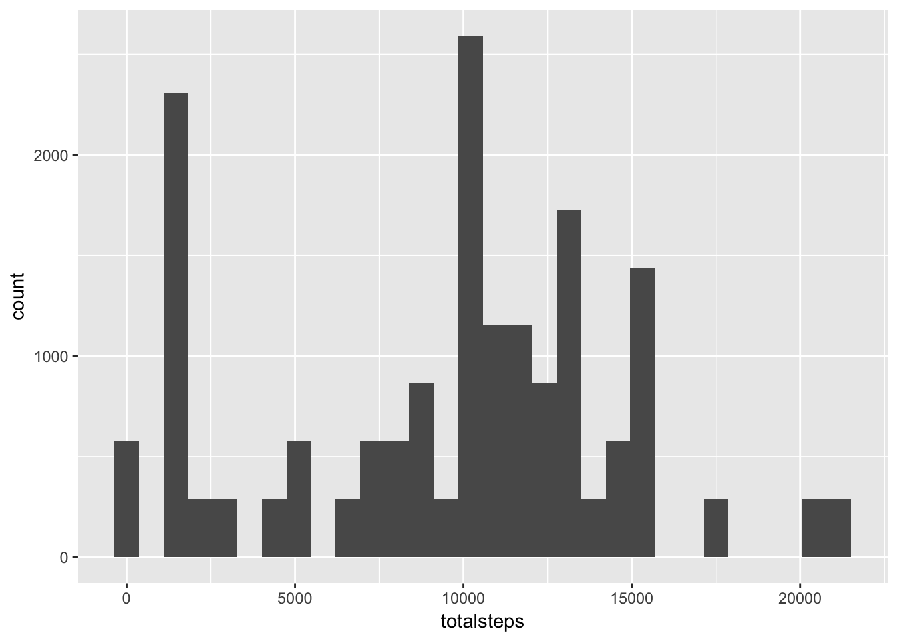
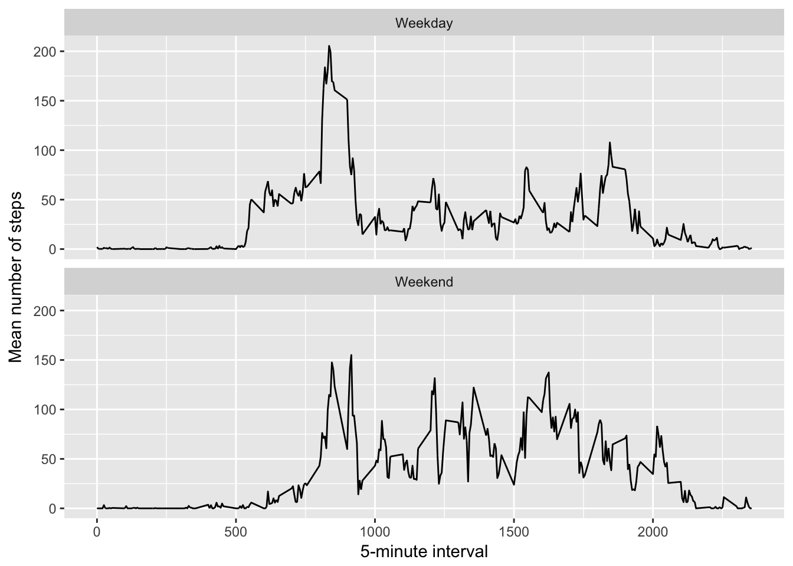

Reproducable Research Course Project 1
================
Mike G.
4/16/2018

\================================================================================

Step 1 is to load the data. This is done with read.table in R. The data
(activity) consists of 3 variables: steps, data, and
interval.

``` r
activity = read.table('~/Documents/HopkinsDataScience/RepData_PeerAssessment1/activity.csv', sep=',', header=TRUE, stringsAsFactors = FALSE)

#convert date to a date format
activity$date = as.Date(activity$date, format='%Y-%m-%d')
```

The second step asks for the what are the mean total of steps take per
day. To do this, we ignore any observations where the number of steps is
NA with na.rm. We pipe the data into group\_by and then to mutate to
create a totalsteps column. A histogram is created using ggplot and then
the mean and median of totalsteps are calculated and displayed.

``` r
library(dplyr)
```

    ## 
    ## Attaching package: 'dplyr'

    ## The following objects are masked from 'package:stats':
    ## 
    ##     filter, lag

    ## The following objects are masked from 'package:base':
    ## 
    ##     intersect, setdiff, setequal, union

``` r
library(ggplot2)
#Calculate total number of steps take per day
#do this with dplyr group_by and summarize and pipe to ggplot to make histogram
activity = activity %>% group_by(date) %>% mutate(totalsteps = sum(steps, na.rm=TRUE))
```

``` r
ggplot(activity, aes(x=totalsteps)) + geom_histogram(bins=20) + 
  xlab('Total steps per day') + ylab('Frequency')
```

<!-- -->

``` r
#calculate mean and median of total steps per day and reprot them
meansteps_na = round(mean(activity$totalsteps, na.rm=TRUE),3)
mediansteps_na = round(median(activity$totalsteps, na.rm=TRUE),3)
```

The mean total steps is 9354.23. The median total steps is 1.039510^{4}.

Step 3: make a time series plot of the 5-minute interval and the average
number of steps taken, averaged across all
days

``` r
#create average number of steps taken across all days by 5-minute interval?
activity_byinterval = activity %>% group_by(interval) %>% mutate(meansteps
                                                      = mean(steps, na.rm=TRUE))
```

``` r
activity_byinterval %>% ggplot(aes(x=interval, y=meansteps)) + geom_line() +
  xlab('5-minute interval') + ylab('Mean number of steps')
```

<!-- -->

``` r
rows = which(activity_byinterval$meansteps== max(activity_byinterval$meansteps))
maxinterval = activity_byinterval[rows[1],3]
print(paste('5-minute interval that contains maximum number of steps: ', maxinterval))
```

    ## [1] "5-minute interval that contains maximum number of steps:  835"

Step 4: Imputing missing values. The first portion of this is to
determine the number of missing values in the dataset. Next, I use the
median value of the interval (e.g., fill in the missing value for
interval 5 with the median of the steps taken in interval 5 without
missing values). Then, a new dataset is created with the missing values
filled in that has the same number of rows as the original dataset.
Next, a histogram of the total number of steps taken each day. Finally,
the mean and median total number of steps taken per day is reported

``` r
#calculate total number of NAs
totalNAs = sum(is.na(activity$steps))
print(paste('Total number missing values: ', totalNAs))
```

    ## [1] "Total number missing values:  2304"

``` r
#strategy for filling in missing data (# steps). Will use the median 
activ_med_missing = activity %>% group_by(interval) %>% mutate(mediansteps = median(steps, na.rm=TRUE))

#replace the NAs in steps with the median value computed above
activ_med_missing$steps[is.na(activ_med_missing$steps)] = 
    activ_med_missing$mediansteps[is.na(activ_med_missing$steps)]

activity_nona = activ_med_missing[,-c(4,5)]
activity_nona = activity_nona %>% group_by(date) %>% mutate(totalsteps = sum(steps, na.rm=TRUE))
```

``` r
#make histogram for new no na dataset
activity_nona %>% group_by(date) %>% ggplot(aes(x=totalsteps)) + geom_histogram()
```

    ## `stat_bin()` using `bins = 30`. Pick better value with `binwidth`.

<!-- -->

``` r
#report mean and median total steps per day
mean_nona = round(mean(activity_nona$totalsteps),3)
median_nona = round(median(activity_nona$totalsteps),2)

mean_nona
```

    ## [1] 9503.869

``` r
median_nona
```

    ## [1] 10395

This shows that the mean number of steps taken per day is greater than
that of the data with the missing values (9354.23, 9503.869). However,
the median is the same (1.039510^{4}, 1.039510^{4}).

The final step in this project is to see if there are differences in
activity patterns between weekdays and weekends. First, create a
variable ‘weekday’ that is the weekday of date in the dataset. Then,
convert this to a factor where 1 is a weekday and 0 is a weekend. Next,
a dataset is created with no missing values and by interval using
group\_by(interval, weekday) and mutate to calculate the mean steps per
interval/weekday. Finally, a plot is created that shows the mean number
of steps by interval/weekday and faceted by weekday.

``` r
#differences in activity patterns between weekdays/weekends?
activity_nona$weekday = weekdays(activity_nona$date)

#create factor variable that distinguishes weekday and weekend (1 = weekday, 0 = weekend)
activity_nona$weekday = gsub('Sunday', 'Weekend', activity_nona$weekday)
activity_nona$weekday = gsub('Saturday', 'Weekend', activity_nona$weekday)
activity_nona$weekday = gsub('Monday', 'Weekday', activity_nona$weekday)
activity_nona$weekday = gsub('Tuesday', 'Weekday', activity_nona$weekday)
activity_nona$weekday = gsub('Wednesday', 'Weekday', activity_nona$weekday)
activity_nona$weekday = gsub('Thursday', 'Weekday', activity_nona$weekday)
activity_nona$weekday = gsub('Friday', 'Weekday', activity_nona$weekday)

activity_nona$weekday = as.factor(activity_nona$weekday)

#panel plot of 5-minute interval and average number of steps across weekdays or weekends
activity_nona_byinterval = activity_nona %>% group_by(interval, weekday) %>% 
  mutate(meansteps = mean(steps))
```

``` r
activity_nona_byinterval %>% ggplot(aes(x=interval, y=meansteps)) + geom_line() +
  facet_wrap( ~ weekday, nrow=2, ncol=1) + ylab('Mean number of steps') + xlab('5-minute interval')
```

<!-- -->

There is a definite differnce in activity between weekdays and weekends.
For weekdays, there is a larger spike early on than in weekends. Weeknds
show a much more consistent activity level throughout the day than in
weekdays. This is probably due to jobs. Weekends tend to be more active
during normal working hours.
